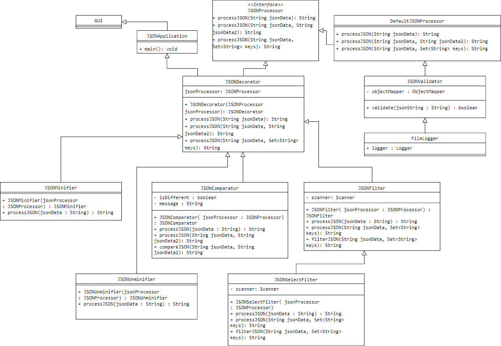

# Description
Application for programmers who need to reformat or filter data structures saved in JSON format and to compare the structures with each other. JSON tools application allows you to both minify the unminified JSON representation, as well as the reverse operation (with any blanks and new lines added). The application will be available via GUI, as well as as a remote API, so it can be integrated with existing tools.

# Google drive
https://drive.google.com/drive/u/1/folders/17UdUmSiG14SCPafehDQ4Pd5X5rlosGc1

# Trello
https://trello.com/b/ZGYBF1VG/json

# UML diagram

# Retrospective (sprint 1)
### things to start doing:
- keep an eye on deadlines
- accepting pull requests by at least 2 other teammates before merge
- systematicaly update planner stuff

### Things to stop doing:
- stop doing any changes on main branch
- creating pull requests with incomplete tasks

### Things to continue:
- good communication inside team
- helipng each other in tasks

# Retrospective (sprint 2)
### things to start doing:
- more unified code across similar classes

### Things to stop doing:
- stop doing any changes on main branch

### Things to continue:
- good communication inside team
- helipng each other in tasks
- keeping scheduled deadlines
